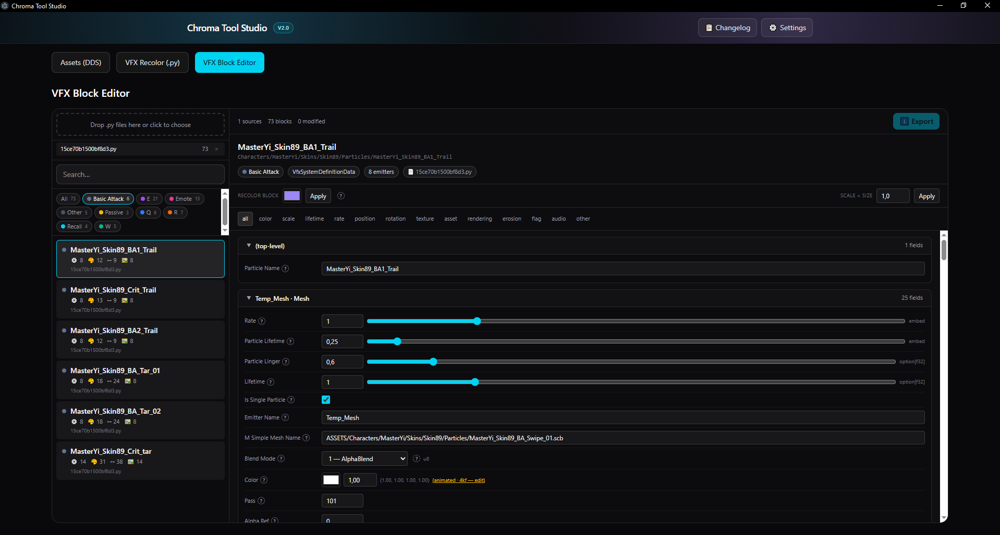
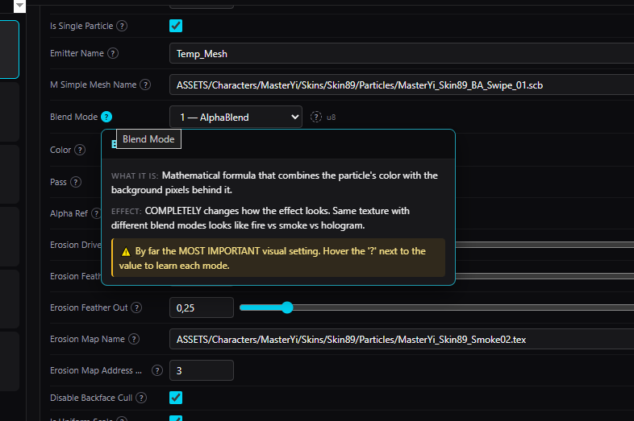

# Chroma Tool Studio

Desktop studio for League custom skin asset recolor, with batch DDS pipeline,
VFX Python recolor, and a **per-block VFX editor** built for learners.

Built by **VISION4RIO**.

---

## What's new in 2.0

### 🧱 VFX Block Editor (new tab)
Where the existing **VFX Recolor** applies one color across an entire `.py`,
the new **VFX Block Editor** lets you work **block by block**:

- Pick any VFX system inside the file (filtered by ability: Q / W / E / R …).
- Tweak only that block's colors, sizes, lifetimes, textures, blend modes,
  and 20+ other parameters — everything else stays untouched.
- Animated colors? An **inline keyframe editor** lets you adjust each
  keyframe (time + rgba), add or remove them.
- One-click "Recolor this block" or "Scale × size" actions for fast iteration.
- Drop multiple files, edit across them, export only what you changed.

### 🌍 Multi-language support
The whole VFX Block Editor (interface, tooltips, **help texts**) speaks:

- 🇺🇸 English
- 🇧🇷 Português (Brasil)
- 🇪🇸 Español

Switch instantly from the language menu in the top bar. Choice is saved
locally so it sticks across sessions.

Adding a new language is as simple as creating a new
`src/i18n/locales/<code>.ts` file with the same shape as `en.ts`.

### ❓ Beginner-friendly help
Every editable parameter has a **"?" button** that opens a popup with:

- **What it is** (plain language)
- **Effect** when you change it
- **💡 Concrete example** ("Use 'Additive' for fire, magic, energy, lasers!")
- **⚠️ Optional pro tip / warning**

72+ exact field explanations + 19 category fallbacks ensure no field is
left without an explanation. Enum values (`blendMode`, `uvMode`, …) also
get individual explanations per option.

---

## Features (full list)

### Assets (DDS) tab
- DDS-first asset workflow (per-file profiles)
- Batch processing with error tolerance (bad DDS files are skipped, job continues)
- Detailed failed-file report after batch run
- 150+ preset ideas for fast exploration
- Apply selected preset to all loaded DDS files
- Preview modes:
  - Side by Side
  - A/B Split
  - Blink Compare
- Fullscreen preview mode

### VFX Recolor (.py) tab
- VFX `.py` recolor with safe behavior for alpha
- Correct neutral output support for VFX recolor (black, gray, white)
- Folder output (no forced ZIP)

### VFX Block Editor (.py) tab — **new in 2.0**
- Lossless `.py` parser/serializer (round-trip verified on 28+ Master Yi files)
- Block catalog with ability filter + free-text search
- 20+ field categories auto-detected and tabbed
- Friendly enum dropdowns (`blendMode` → "🔥 Additive", etc.)
- Animated color keyframe editor
- Per-block quick actions (recolor / scale)
- Per-source modification tracking + selective export

### Cross-cutting
- ⚙ Settings dialog with language selector
- 🌐 Top-bar language menu (instant switch + persistence)
- Electron desktop auto-updater via GitHub Releases

---

## Tabs

- **Assets (DDS)** — detect zones, edit per-file colors, run batch recolor.
- **VFX Recolor (.py)** — recolor supported color fields across an entire VFX script.
- **VFX Block Editor** — surgical per-block editing of every VFX parameter,
  with built-in beginner help.

---

## Multi-language support

Switch the interface language from the top bar or **Settings ⚙ → Language**.
Three languages ship by default; adding a new one is as simple as:

1. Copy `src/i18n/locales/en.ts` → `src/i18n/locales/<code>.ts`.
2. Translate the strings.
3. Register the new code in `src/i18n/index.tsx` (`LANGS` array + `DICTS`).
4. Rebuild.

The English locale always acts as the safety net — any missing key from
another language falls back to English instead of breaking the UI.

---

## Auto Update

On app startup, Chroma Tool Studio checks for a newer GitHub release.

- If update exists: prompt with **Update Now** or **Continue Without Updating**.
- If accepted: downloads latest release and offers **Install and Restart**.

Updater source:

- <https://github.com/VISION4RIO/chroma-tool-studio/releases/latest>

---

## Screenshots

Put screenshots in `docs/screenshots/`:

| Main Workspace | Block Editor | Help Popup |
| --- | --- | --- |
|  |  |  |

---

## Contributing translations

PRs welcome! To translate the app to a new language:

1. Fork the repo.
2. Add `src/i18n/locales/<code>.ts` (use `en.ts` as the template).
3. Register the language in `src/i18n/index.tsx`.
4. Open a PR — you'll be credited in the next release notes.
