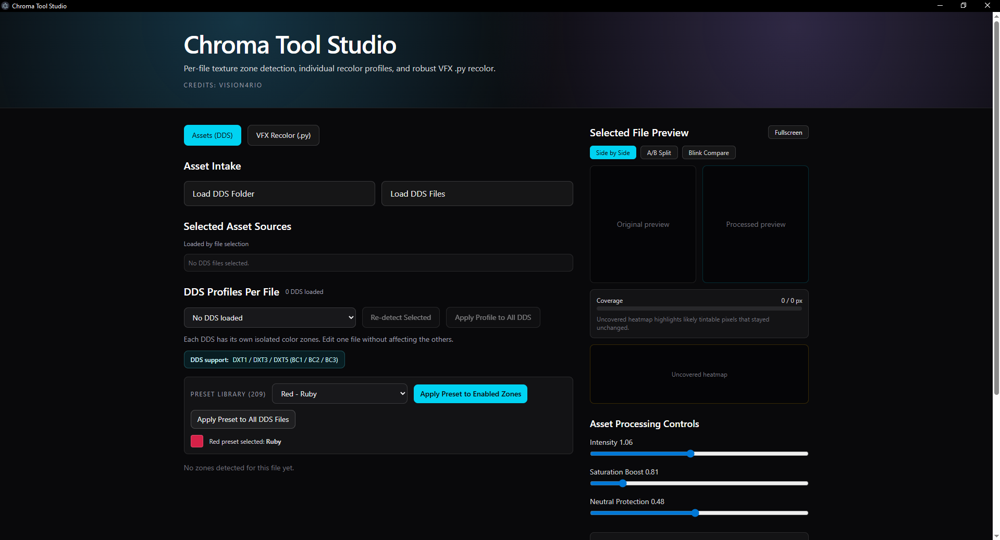
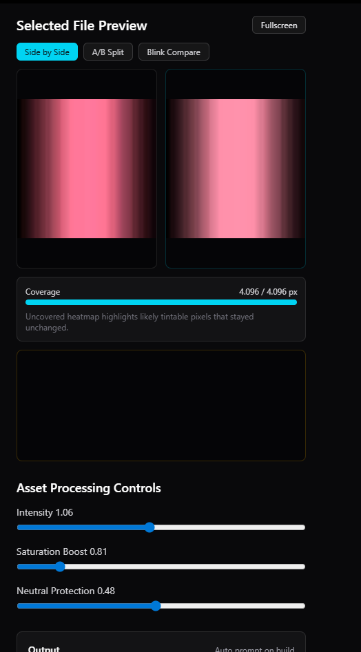
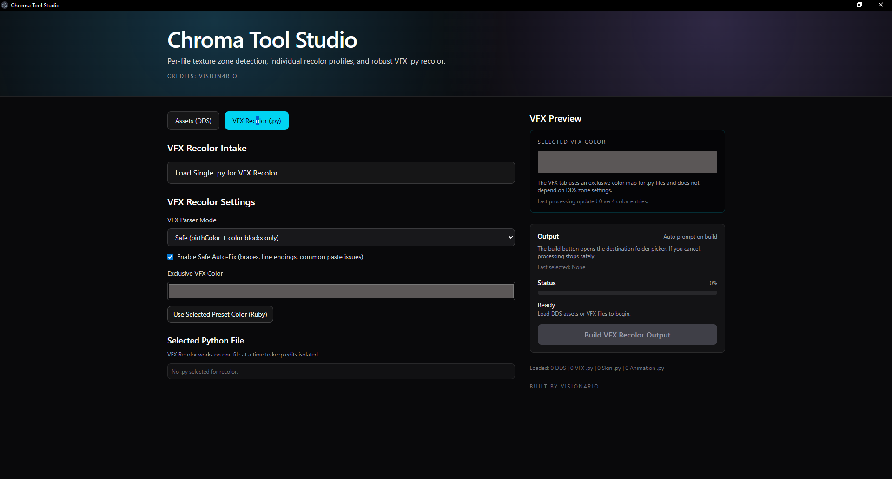
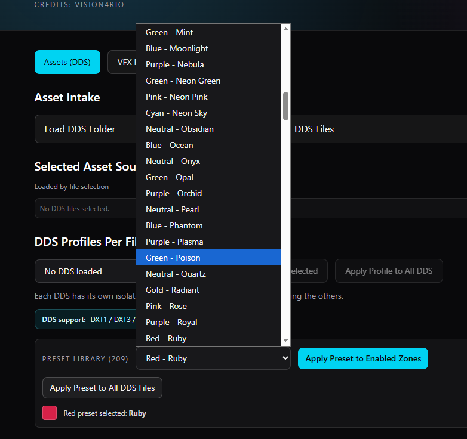

# Chroma Tool Studio

[](https://github.com/VISION4RIO/chroma-tool-studio/releases/latest)
[](https://www.microsoft.com/windows)
[](https://www.electronjs.org/)
[](https://www.typescriptlang.org/)

Desktop studio for League custom skin asset recolor, with batch DDS pipeline and VFX Python recolor.

Built by **VISION4RIO**.

## Features

- DDS-first asset workflow (per-file profiles)
- Batch processing with error tolerance (bad DDS files are skipped, job continues)
- Detailed failed-file report after batch run
- 150+ preset ideas for fast exploration
- Apply selected preset to all loaded DDS files
- Preview modes:
  - Side by Side
  - A/B Split
  - Blink Compare
- Fullscreen preview mode
- VFX `.py` recolor with safe behavior for alpha
- Correct neutral output support for VFX recolor (black, gray, white)
- Folder output (no forced ZIP)
- Electron desktop auto-updater via GitHub Releases

## Tabs

- **Assets (DDS)**: detect zones, edit per-file colors, run batch recolor.
- **VFX Recolor (.py)**: recolor supported color fields in VFX scripts.

## Auto Update

On app startup, Chroma Tool Studio checks for a newer GitHub release.

- If update exists: prompt with **Update Now** or **Continue Without Updating**.
- If accepted: downloads latest release and offers **Install and Restart**.

Updater source:

- https://github.com/VISION4RIO/chroma-tool-studio/releases/latest

## Screenshots

Put screenshots in `docs/screenshots/` using these names:

| Main Workspace | Asset Preview |
|---|---|
|  |  |

| VFX Tab | Preset Library |
|---|---|
|  |  |

## Install (Users)

1. Open Releases: https://github.com/VISION4RIO/chroma-tool-studio/releases/latest
2. Download `Chroma-Tool-Studio-Setup-<version>.exe`
3. Run installer
4. Launch from desktop shortcut

## Build (Windows)

Requirements:

- Node.js 18+
- npm
- Windows 10/11

Commands:

```bash
npm install
npm run build
node scripts/build-windows-installer.mjs
```

Output:

- `release/`

## Releasing (Required for Auto-Updater)

For each new version release, upload all updater artifacts:

- `Chroma-Tool-Studio-Setup-<version>.exe`
- `latest.yml`
- `*.blockmap`

If `latest.yml` is missing, auto-update will not detect the new version correctly.

## Changelog

See [CHANGELOG.md](./CHANGELOG.md).

## Credits

Created and maintained by **VISION4RIO**.
